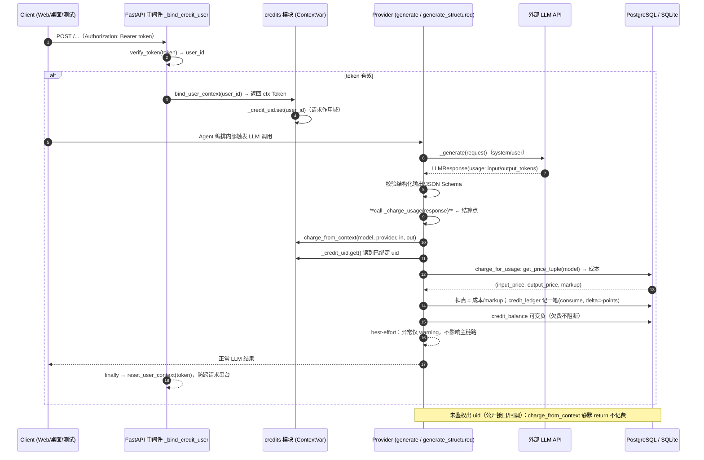

# YIWA Studio · 点数计费系统架构（Billing Architecture）

> 本文档说明「引擎级点数计费」的整体设计：为何这样设计、请求级上下文如何打通、扣费/充值/流水如何落地。

## 一句话
把『按 token 对用户收费』做成对既有业务零侵入的旁路能力：不污染调 LLM 的接口，却能在每次调用后准确记一笔用户的点数消费。

## 核心难点：Agent 内部调用没有『用户』

Agent 有很多层（orchestrate → director → world/character/plot...），最深处才真正调用 LLM。如果直接在这些调用点各自记费，得把 user id 一路传下去，侵入面巨大、极易漏记。

## 解法：请求作用域上下文（async ContextVar）+ 可插拔结算钩子

```
                HTTP 请求（带 Bearer token）
                         |
                         v
        FastAPI 中间件：解析 Bearer 得 user id
        bind_user_context(user_id) 写入异步上下文
                         |
        （任何 Agent 内部协程读同一 ContextVar）
                         v
        Provider.generate() 拿到 usage 之后
        挂 best-effort 结算钩子 charge_from_context
          | 绑定了用户 → 记一笔；未绑定 → 静默跳过（绝不 throw）
          v
        credits.charge_for_usage()：engine单价 → 成本/markup → 扣点
        余额可自变为负（欠费），但仍记 ledger
```

## 字段与公式

- 单价：CreditPrice(model, input_price, output_price, markup)，元/百万 token，后台可配（/prices）。
- 成本 RMB = (input_tokens * in_p + output_tokens * out_p) / 1_000_000。
- 扣费点数 = 成本 / markup；markup=0.6 即 cost / 0.6 ≈ cost × 1.667，对应约 40% 毛利。
- 余额可为负：user.credit_balance -= points（不阻断流程），失败分支只 warning。

## 三张表

| 表 | 作用 |
| --- | --- |
| credit_prices | 引擎单价配表（输入/输出价格 + markup） |
| redeem_codes | 兑换码：运营 mint → 用户 redeem（防重/防伪/一次性） |
| credit_ledger | 全量流水：充值(+) / 消费(-)，可追溯、可对账 |

alembic migration：alembic/versions/0015_credits.py（纯新增，不破坏旧表）。

## 细粒度时序图（真实代码对应）

> 参与者对应真实模块：client=前端/测试；`_bind_credit_user`=`app/main.py` 中间件；`credits`=`app/services/credits.py`；`Provider`=`app/llm/provider.py`。
> `_charge_usage` 仅在 `generate()` / `generate_structured()` 触发；`stream()` 与 `embed()` 不记费（按会话聚合使用量留待后续）。



### 时序要点
1. 用户身份只绑定一次（中间件），之后整个请求树里任何深层 Agent/Provider 都能读到；
2. 结算挂在 Provider 内部 `_charge_usage`，对上层编排代码不可见——存量业务零改动；
3. `stream`/`embed` 不做单次扣费（避免流式多 chunk 记成多次），按会话聚合留后续；
4. `finally reset` 用 `contextvars.Token` 精确还原，防止协程复用上下文串账；
5. 所有失败 best-effort：扣费异常只 warning，绝不影响用户拿到 LLM 结果。

